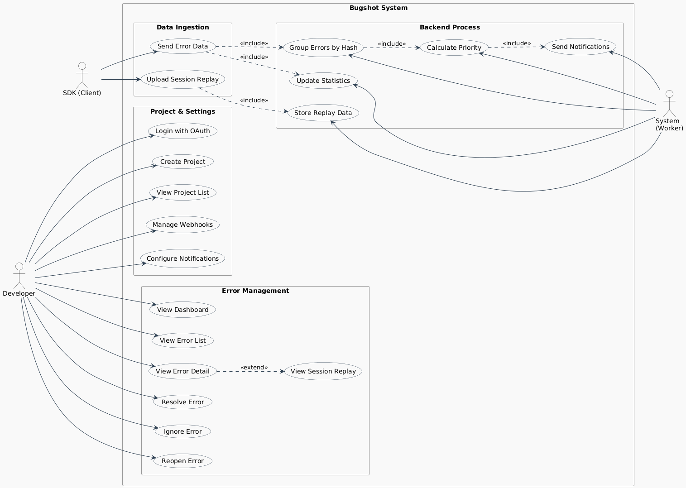
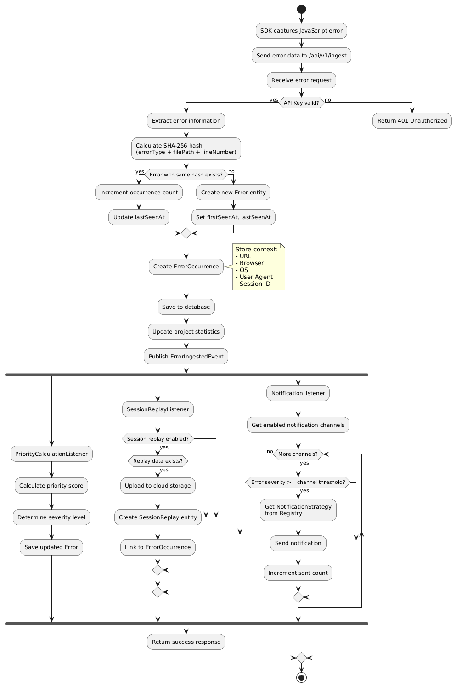
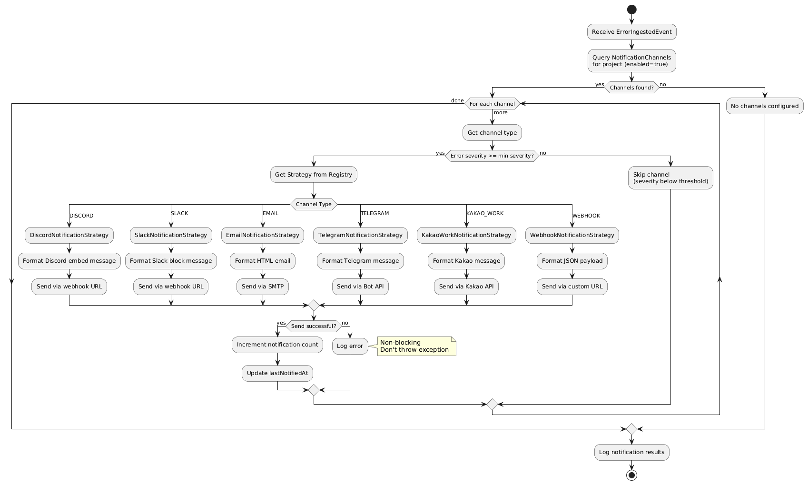

# Bugshot: Real-time Error Monitoring System

## Final Project Report

**Authors**: 김덕환 (20200477), 정은재 (20226495) **Assignment**: Project #4

> **Live Demo Available!** This project is deployed and running in production.
>
> - Frontend: https://bugshot.log8.kr
> - API Documentation: https://bugshot-api.log8.kr/swagger-ui/index.html
> - GitHub: https://github.com/IISweetHeartII/bugshot

---

## 1. Project Overview

### 1.1 System Introduction

Bugshot is a comprehensive error monitoring service that captures JavaScript errors from web applications in real-time. Unlike traditional logging solutions, Bugshot provides intelligent error grouping, priority-based alerts, and session replay capabilities.

The system consists of multiple components working together as a full-stack application:

| Component       | Technology                        | Description                       |
| --------------- | --------------------------------- | --------------------------------- |
| **Backend API** | Spring Boot 3.5 (Java 21)         | REST API server, business logic   |
| **Frontend**    | Next.js 16 (React 19, TypeScript) | Web dashboard with BFF pattern    |
| **Browser SDK** | TypeScript                        | Error capture & session replay    |
| **React SDK**   | React                             | React integration wrapper         |
| **Database**    | MySQL 8.0                         | Persistent data storage           |
| **Cache**       | Redis 6.0                         | Statistics caching, rate limiting |

### 1.2 Design Goals

- **Real-time Error Detection**: Automatically capture JavaScript errors via SDK integration
- **Intelligent Error Grouping**: Use SHA-256 hashing to deduplicate similar errors
- **Priority-based Alerting**: Automatically calculate error severity and notify developers
- **Session Replay**: Record user sessions to understand the context of errors
- **Multi-channel Notifications**: Support Discord, Slack, Email, Kakao Work, Telegram, and Webhooks

---

## 2. System Architecture

### 2.1 Overall Architecture

```
┌─────────────────────────────────────────────────────────────────┐
│                      Bugshot Architecture                        │
├─────────────────────────────────────────────────────────────────┤
│                                                                  │
│  ┌──────────┐     ┌──────────────┐     ┌──────────────┐         │
│  │   SDK    │────▶│  Ingest API  │────▶│    Error     │         │
│  │ (Browser)│     │  Controller  │     │   Service    │         │
│  └──────────┘     └──────────────┘     └──────┬───────┘         │
│                                               │                  │
│                            ┌──────────────────┴────────┐        │
│                            │     Event Publisher       │        │
│                            └──────────────────┬────────┘        │
│                                               │                  │
│            ┌──────────────┬──────────────┬────┴───────┐         │
│            ▼              ▼              ▼            ▼         │
│    ┌───────────┐  ┌───────────┐  ┌───────────┐  ┌────────┐     │
│    │ Priority  │  │  Session  │  │Notification│  │ Stats  │     │
│    │ Listener  │  │  Replay   │  │  Listener  │  │Listener│     │
│    └───────────┘  └───────────┘  └─────┬─────┘  └────────┘     │
│                                        │                        │
│                              ┌─────────┴─────────┐              │
│                              │ Strategy Registry │              │
│                              └─────────┬─────────┘              │
│                   ┌─────────┬─────────┬┴────────┬────────┐     │
│                   ▼         ▼         ▼         ▼        ▼     │
│              ┌────────┐┌────────┐┌────────┐┌────────┐┌────────┐│
│              │Discord ││ Slack  ││ Email  ││ Kakao  ││Telegram││
│              │Strategy││Strategy││Strategy││Strategy││Strategy││
│              └────────┘└────────┘└────────┘└────────┘└────────┘│
│                                                                  │
└─────────────────────────────────────────────────────────────────┘
```

### 2.2 Deployment Architecture

The project is deployed and running in production:

```
┌─────────────────────────────────────────────────────────────────┐
│                    Production Deployment                         │
├─────────────────────────────────────────────────────────────────┤
│                                                                  │
│   [Users]                                                        │
│      │                                                           │
│      ▼                                                           │
│   ┌──────────────────┐                                          │
│   │   Cloudflare     │  CDN, DDoS Protection                    │
│   │   (DNS + WAF)    │                                          │
│   └────────┬─────────┘                                          │
│            │                                                     │
│      ┌─────┴─────┐                                              │
│      │           │                                              │
│      ▼           ▼                                              │
│ ┌─────────┐  ┌─────────────┐                                   │
│ │ Vercel  │  │ Cloudflare  │                                   │
│ │         │  │   Tunnel    │                                   │
│ │ Next.js │  └──────┬──────┘                                   │
│ │ Frontend│         │                                          │
│ └────┬────┘         ▼                                          │
│      │       ┌─────────────┐                                   │
│      │       │  Mac Mini   │                                   │
│      │       │  (Docker)   │                                   │
│      │       │             │                                   │
│      │       │ ┌─────────┐ │                                   │
│      └──────▶│ │ Spring  │ │                                   │
│   (API calls)│ │ Boot    │ │                                   │
│              │ └────┬────┘ │                                   │
│              │      │      │                                   │
│              │ ┌────┴────┐ │                                   │
│              │ │ MySQL   │ │                                   │
│              │ │ Redis   │ │                                   │
│              │ └─────────┘ │                                   │
│              └─────────────┘                                   │
│                     │                                           │
│                     ▼                                           │
│              ┌─────────────┐                                   │
│              │Cloudflare R2│  Session Replay Storage           │
│              └─────────────┘                                   │
│                                                                  │
└─────────────────────────────────────────────────────────────────┘
```

| Service         | Platform          | URL                                               | Status    |
| --------------- | ----------------- | ------------------------------------------------- | --------- |
| **Frontend**    | Vercel            | https://bugshot.log8.kr                           | ✅ Live   |
| **Backend API** | Mac Mini + Docker | https://bugshot-api.log8.kr                       | ✅ Live   |
| **API Docs**    | Swagger UI        | https://bugshot-api.log8.kr/swagger-ui/index.html | ✅ Live   |
| **GitHub**      | Public Repository | https://github.com/IISweetHeartII/bugshot         | ✅ Public |

---

## 3. Build and Execution Instructions

### 3.1 System Requirements

| Component  | Requirement                   |
| ---------- | ----------------------------- |
| Java       | JDK 21 or higher              |
| Build Tool | Gradle 8.x (wrapper included) |
| Database   | MySQL 8.0+                    |
| Cache      | Redis 6.0+ (optional)         |
| OS         | Windows 10+, macOS, Linux     |

### 3.2 How to Compile

```bash
# Windows
gradlew.bat build -x test

# Linux/Mac
./gradlew build -x test
```

> **Note**: The `-x test` flag skips tests as they require MySQL connection.

### 3.3 How to Execute

#### Option 1: Use Live Demo (Recommended)

Visit https://bugshot.log8.kr to test the application without any setup.

#### Option 2: Run JAR File

```bash
java -jar build/libs/bugshot-0.0.1-SNAPSHOT.jar
```

> **Note**: Local execution requires MySQL 8.0 and Redis 6.0 configuration.

### 3.4 Verify Execution

- **Main Application**: http://localhost:8081
- **Swagger UI**: http://localhost:8081/swagger-ui.html
- **Health Check**: http://localhost:8081/actuator/health

---

## 4. Core Features

### 4.1 Error Collection (Ingest API)

The SDK captures JavaScript errors and sends them to the backend:

```java
// IngestController.java
@PostMapping("/api/v1/ingest")
public ResponseEntity<IngestResponse> ingest(
    @RequestHeader("X-API-Key") String apiKey,
    @RequestBody IngestRequest request) {

    Project project = projectService.validateApiKey(apiKey);
    Error error = errorService.processError(project, request);

    // Publish event for async processing
    eventPublisher.publishEvent(new ErrorIngestedEvent(project, error));

    return ResponseEntity.ok(new IngestResponse(error.getId()));
}
```

### 4.2 Error Deduplication

Uses SHA-256 hash to group identical errors:

```java
// ErrorService.java
public static String calculateErrorHash(String errorType, String filePath, Integer lineNumber) {
    String input = errorType + "|" + filePath + "|" + lineNumber;
    MessageDigest md = MessageDigest.getInstance("SHA-256");
    byte[] hash = md.digest(input.getBytes(StandardCharsets.UTF_8));

    StringBuilder hexString = new StringBuilder();
    for (byte b : hash) {
        hexString.append(String.format("%02x", b));
    }
    return hexString.toString();
}
```

### 4.3 Priority Calculation

Automatic priority scoring based on multiple factors:

```java
// Error.java
public void calculatePriority(String url) {
    double pageWeight = determinePageWeight(url);
    // Checkout: 10x, Login: 8x, Homepage: 5x, Others: 1x

    this.priorityScore = BigDecimal.valueOf(
        occurrenceCount * affectedUsersCount * pageWeight
    );
}
```

### 4.4 Multi-channel Notifications

| Channel    | Description                  |
| ---------- | ---------------------------- |
| Discord    | Webhook + Bot integration    |
| Slack      | Webhook notifications        |
| Email      | SMTP-based alerts            |
| Kakao Work | Korean messenger integration |
| Telegram   | Bot API notifications        |
| Webhook    | Custom HTTP endpoints        |

---

## 5. Class Structure

### 5.1 Domain Layer Overview

```
domain/
├── auth/               # User authentication
│   ├── User.java           - OAuth user entity (GitHub, Google)
│   ├── UserRepository.java
│   └── UserService.java
│
├── project/            # Project management
│   ├── Project.java        - API key, environment settings
│   ├── ProjectRepository.java
│   └── ProjectService.java
│
├── error/              # Error handling core
│   ├── Error.java          - Error grouping, priority
│   ├── ErrorOccurrence.java - Individual occurrences
│   ├── ErrorRepository.java
│   └── ErrorService.java
│
├── notification/       # Multi-channel notifications
│   ├── NotificationChannel.java
│   ├── NotificationStrategy.java (interface)
│   ├── DiscordNotificationStrategy.java
│   ├── SlackNotificationStrategy.java
│   ├── EmailNotificationStrategy.java
│   └── NotificationService.java
│
├── replay/             # Session replay
│   ├── SessionReplay.java
│   ├── ReplayStorageService.java
│   └── CloudflareR2Service.java
│
└── dashboard/          # Statistics
    ├── DashboardService.java
    └── StatisticsDto.java
```

### 5.2 UML Diagrams

#### Class Diagram


#### Use Case Diagram



#### Activity Diagram - Error Ingest Process



#### Activity Diagram - Notification Process



---

### 5.3 Key Class Relationships (Text Reference)

```
┌─────────────────────────────────────────────────────────────────┐
│                      Class Relationships                         │
├─────────────────────────────────────────────────────────────────┤
│                                                                  │
│                    ┌───────────┐                                │
│                    │ BaseEntity│                                │
│                    │-createdAt │                                │
│                    │-updatedAt │                                │
│                    └─────┬─────┘                                │
│                          │ extends                              │
│          ┌───────────────┼───────────────┐                     │
│          ▼               ▼               ▼                     │
│    ┌───────────┐  ┌───────────┐  ┌───────────────┐            │
│    │   User    │  │  Project  │  │     Error     │            │
│    ├───────────┤  ├───────────┤  ├───────────────┤            │
│    │-email     │  │-name      │  │-errorHash     │            │
│    │-name      │◀─┤-apiKey    │◀─┤-errorType     │            │
│    │-planType  │──┤-user      │──┤-project       │            │
│    │-oauthType │  │-errors    │  │-occurrences   │            │
│    └───────────┘  └───────────┘  │-priorityScore │            │
│                                  └───────┬───────┘            │
│                                          │ 1:N                 │
│                                          ▼                     │
│                                  ┌───────────────┐            │
│                                  │ErrorOccurrence│            │
│                                  ├───────────────┤            │
│                                  │-url           │            │
│                                  │-userAgent     │            │
│                                  │-sessionId     │            │
│                                  │-stackTrace    │            │
│                                  └───────────────┘            │
│                                                                  │
│   ┌─────────────────────────────────────────────────────────┐  │
│   │              <<interface>>                               │  │
│   │            NotificationStrategy                          │  │
│   ├─────────────────────────────────────────────────────────┤  │
│   │ + getChannelType(): ChannelType                         │  │
│   │ + send(channel, project, error, occurrence): void       │  │
│   │ + sendTest(channel): void                               │  │
│   └──────────────────────┬──────────────────────────────────┘  │
│              ┌───────────┼───────────┬───────────┐             │
│              ▼           ▼           ▼           ▼             │
│         ┌────────┐  ┌────────┐  ┌────────┐  ┌────────┐        │
│         │Discord │  │ Slack  │  │ Email  │  │Telegram│        │
│         │Strategy│  │Strategy│  │Strategy│  │Strategy│        │
│         └────────┘  └────────┘  └────────┘  └────────┘        │
│                                                                  │
└─────────────────────────────────────────────────────────────────┘
```

---

## 6. Object-Oriented Concepts Applied

### 6.1 Encapsulation

Each entity class encapsulates its data with private fields and exposes behavior through public methods:

```java
// Error.java - Business logic encapsulated in entity
public class Error extends BaseEntity {
    private Integer occurrenceCount = 1;
    private BigDecimal priorityScore;

    // Encapsulated behavior
    public void incrementOccurrence() {
        this.occurrenceCount++;
        this.lastSeenAt = LocalDateTime.now();
    }

    public void calculatePriority(String url) {
        double pageWeight = determinePageWeight(url);
        this.priorityScore = BigDecimal.valueOf(
            occurrenceCount * affectedUsersCount * pageWeight
        );
    }

    // Page weight is internal implementation detail
    private double determinePageWeight(String url) {
        if (url.contains("/checkout")) return 10.0;
        if (url.contains("/login")) return 8.0;
        if (url.equals("/")) return 5.0;
        return 1.0;
    }
}
```

### 6.2 Inheritance

`BaseEntity` provides common audit fields to all entities:

```java
// BaseEntity.java - Parent class
@MappedSuperclass
@EntityListeners(AuditingEntityListener.class)
public abstract class BaseEntity {
    @CreatedDate
    private LocalDateTime createdAt;

    @LastModifiedDate
    private LocalDateTime updatedAt;
}

// User.java - Child class
@Entity
public class User extends BaseEntity {
    // Inherits createdAt, updatedAt automatically
    private String email;
    private String name;
    private PlanType planType;
}
```

**Benefit**: All entities automatically have creation/modification timestamps without code duplication.

### 6.3 Polymorphism

`NotificationStrategy` interface with multiple implementations:

```java
// Interface definition
public interface NotificationStrategy {
    ChannelType getChannelType();
    void send(NotificationChannel channel, Project project,
              Error error, ErrorOccurrence occurrence);
    void sendTest(NotificationChannel channel);
}

// Discord implementation
@Component
public class DiscordNotificationStrategy implements NotificationStrategy {
    @Override
    public ChannelType getChannelType() {
        return ChannelType.DISCORD;
    }

    @Override
    public void send(NotificationChannel channel, Project project,
                     Error error, ErrorOccurrence occurrence) {
        // Discord-specific webhook logic
        String webhookUrl = channel.getConfig().get("webhookUrl");
        // ... send to Discord
    }
}

// Slack implementation
@Component
public class SlackNotificationStrategy implements NotificationStrategy {
    @Override
    public ChannelType getChannelType() {
        return ChannelType.SLACK;
    }

    @Override
    public void send(NotificationChannel channel, Project project,
                     Error error, ErrorOccurrence occurrence) {
        // Slack-specific webhook logic
        // ... send to Slack
    }
}
```

**Usage** - Same interface, different behavior:

```java
// NotificationService.java
public void sendNotification(NotificationChannel channel, ...) {
    // Get appropriate strategy based on channel type
    NotificationStrategy strategy = strategyRegistry.getStrategy(channel.getChannelType());

    // Polymorphic call - actual implementation varies
    strategy.send(channel, project, error, occurrence);
}
```

### 6.4 Abstraction

Complex notification logic abstracted behind simple interface:

```java
// Client code doesn't know implementation details
notificationService.notifyError(project, error, occurrence);

// NotificationService handles all complexity internally:
// - Finding enabled channels for the project
// - Filtering by severity threshold
// - Selecting appropriate strategy for each channel
// - Error handling and retry logic
// - Async processing
```

---

## 7. Design Patterns Applied

### 7.1 Strategy Pattern

**Purpose**: Encapsulate notification algorithms for different channels.

```
┌─────────────────────────────────────────────────────────────────┐
│                     Strategy Pattern                             │
├─────────────────────────────────────────────────────────────────┤
│                                                                  │
│  NotificationService                                            │
│         │                                                       │
│         │ uses                                                  │
│         ▼                                                       │
│  ┌─────────────────┐                                           │
│  │StrategyRegistry │─────────────────────────────────┐         │
│  └─────────────────┘                                 │         │
│         │                                            │         │
│         │ getStrategy(channelType)                   │         │
│         ▼                                            ▼         │
│  ┌─────────────────────────────────────────────────────────┐  │
│  │            <<interface>> NotificationStrategy            │  │
│  └─────────────────────────────────────────────────────────┘  │
│              △           △           △           △             │
│              │           │           │           │             │
│         ┌────┴────┐ ┌────┴────┐ ┌────┴────┐ ┌────┴────┐      │
│         │Discord  │ │ Slack   │ │ Email   │ │Telegram │      │
│         │Strategy │ │Strategy │ │Strategy │ │Strategy │      │
│         └─────────┘ └─────────┘ └─────────┘ └─────────┘      │
│                                                                  │
└─────────────────────────────────────────────────────────────────┘
```

**Benefit**: Easy to add new notification channels without modifying existing code.

### 7.2 Observer Pattern

**Purpose**: Decouple error processing from side effects using Spring Events.

```java
// Publisher - ErrorService.java
@Service
public class ErrorService {
    private final ApplicationEventPublisher eventPublisher;

    public Error processError(Project project, IngestRequest request) {
        Error error = saveError(project, request);

        // Publish event - observers will handle async processing
        eventPublisher.publishEvent(new ErrorIngestedEvent(project, error, occurrence));

        return error;
    }
}

// Observer 1 - NotificationListener.java
@Component
public class NotificationListener {
    @Async
    @EventListener
    public void handleErrorIngested(ErrorIngestedEvent event) {
        notificationService.notifyError(event.getProject(), event.getError());
    }
}

// Observer 2 - PriorityCalculationListener.java
@Component
public class PriorityCalculationListener {
    @Async
    @EventListener
    public void handleErrorIngested(ErrorIngestedEvent event) {
        event.getError().calculatePriority(event.getOccurrence().getUrl());
        errorRepository.save(event.getError());
    }
}

// Observer 3 - StatisticsListener.java
@Component
public class StatisticsListener {
    @Async
    @EventListener
    public void handleErrorIngested(ErrorIngestedEvent event) {
        dashboardService.updateStatistics(event.getProject());
    }
}
```

**Benefit**: Loose coupling, async processing, easy to add new side effects.

### 7.3 Builder Pattern

**Purpose**: Create complex objects step by step using Lombok `@Builder`.

```java
// Entity creation with builder
Error error = Error.builder()
    .project(project)
    .errorType("TypeError")
    .errorMessage("Cannot read property 'name' of undefined")
    .filePath("/checkout/payment.js")
    .lineNumber(42)
    .columnNumber(15)
    .build();

// DTO creation with builder
ErrorDetailResponse response = ErrorDetailResponse.builder()
    .id(error.getId())
    .errorType(error.getErrorType())
    .message(error.getErrorMessage())
    .occurrenceCount(error.getOccurrenceCount())
    .priorityScore(error.getPriorityScore())
    .lastSeenAt(error.getLastSeenAt())
    .build();
```

### 7.4 Repository Pattern

**Purpose**: Abstract data access layer using Spring Data JPA.

```java
// Repository interface
public interface ErrorRepository extends JpaRepository<Error, Long> {
    Optional<Error> findByProjectAndErrorHash(Project project, String errorHash);
    List<Error> findByProjectOrderByPriorityScoreDesc(Project project);

    @Query("SELECT e FROM Error e WHERE e.project = :project AND e.status = :status")
    Page<Error> findByProjectAndStatus(Project project, ErrorStatus status, Pageable pageable);
}

// Service uses repository without knowing implementation details
@Service
public class ErrorService {
    private final ErrorRepository errorRepository;

    public Error findOrCreateError(Project project, String errorHash) {
        return errorRepository.findByProjectAndErrorHash(project, errorHash)
            .orElseGet(() -> createNewError(project, errorHash));
    }
}
```

---

## 8. API Endpoints

| Method | Endpoint                         | Description                 |
| ------ | -------------------------------- | --------------------------- |
| POST   | `/api/v1/ingest`                 | Receive error from SDK      |
| GET    | `/api/v1/errors`                 | List errors for project     |
| GET    | `/api/v1/errors/{id}`            | Get error detail            |
| POST   | `/api/v1/errors/{id}/resolve`    | Mark as resolved            |
| POST   | `/api/v1/errors/{id}/ignore`     | Mark as ignored             |
| GET    | `/api/v1/projects`               | List user's projects        |
| POST   | `/api/v1/projects`               | Create new project          |
| GET    | `/api/v1/dashboard/stats`        | Get dashboard statistics    |
| POST   | `/api/v1/notifications/channels` | Create notification channel |
| POST   | `/api/v1/notifications/test`     | Test notification channel   |

---

## 9. Conclusion

### 9.1 Project Summary

Bugshot successfully demonstrates the application of Object-Oriented Programming concepts in building a real-world error monitoring system. The project showcases:

1. **Practical OOP Application**: Encapsulation, inheritance, and polymorphism are effectively used throughout the codebase.

2. **Design Pattern Usage**: Strategy, Observer, Builder, and Repository patterns provide flexible, maintainable architecture.

3. **Real-world Deployment**: The system is deployed and running in production, demonstrating practical software engineering skills.

### 9.2 Technical Achievements

- SHA-256 based error deduplication algorithm
- Event-driven architecture for loose coupling
- Strategy pattern for extensible notification system
- RESTful API design with Swagger documentation
- Full-stack deployment with CI/CD pipeline

### 9.3 Lessons Learned

- Importance of proper abstraction for maintainability
- Value of design patterns in solving common problems
- Benefits of event-driven architecture for scalability
- Real-world deployment challenges and solutions

---

## Appendix

### A. Technology Stack

| Category         | Technology                    |
| ---------------- | ----------------------------- |
| Language         | Java 21                       |
| Framework        | Spring Boot 3.5               |
| Database         | MySQL 8.0, Redis 6.0          |
| ORM              | Spring Data JPA               |
| Build            | Gradle 8.x                    |
| API Docs         | SpringDoc OpenAPI (Swagger)   |
| Async Processing | Spring @Async, @EventListener |
| Storage          | Cloudflare R2                 |

### B. Project Structure

```
backend/
├── src/main/java/com/bugshot/
│   ├── BugshotApplication.java
│   ├── domain/
│   │   ├── auth/           # User authentication (OAuth)
│   │   ├── project/        # Project management
│   │   ├── error/          # Error handling core
│   │   ├── notification/   # Multi-channel notifications
│   │   ├── replay/         # Session replay
│   │   ├── webhook/        # Webhook configuration
│   │   └── dashboard/      # Statistics
│   └── global/
│       ├── config/         # Spring configurations
│       ├── security/       # Security filters
│       └── exception/      # Exception handling
└── src/main/resources/
    └── application.yml
```

---

**End of Report**
