# Bugshot: Real-time Error Monitoring System

## Final Project Report

**Course**: Object Oriented Programming (Prof. Bong-Soo Sohn)
**Team Members**: 김덕환 (20200477), 정은재 (20226495)
**Project**: #4

---

## (a) Project Summary

### Project Title

**Bugshot** - Real-time JavaScript Error Monitoring System

### Team Members

| Name   | Student ID | Role                               |
| ------ | ---------- | ---------------------------------- |
| 김덕환 | 20200477   | Team Leader, Backend Development   |
| 정은재 | 20226495   | Backend Development, Documentation |

### Brief Description

Bugshot is a backend API server that monitors JavaScript errors from web applications in real-time. The system provides:

- **Error Collection**: SDK sends error data to the backend via REST API
- **Intelligent Grouping**: SHA-256 hash-based error deduplication
- **Priority Calculation**: Automatic severity scoring based on page importance and occurrence frequency
- **Multi-channel Notifications**: Discord, Slack, Email, Telegram, Kakao Work integration
- **Session Replay Storage**: Cloudflare R2 integration for user session recording

**Live Demo**: https://bugshot-api.log8.kr/swagger-ui/index.html

---

## (b) How to Compile and Execute

But I reccomend you to visit my frontend-website(https://bugshot.log8.kr) and backend-website(https://bugshot-api.log8.kr/swagger-ui/index.html)

### System Requirements

| Component  | Requirement                   |
| ---------- | ----------------------------- |
| Java       | JDK 21 or higher              |
| Build Tool | Gradle 8.x (wrapper included) |
| Database   | MySQL 8.0+                    |
| Cache      | Redis 6.0+ (optional)         |
| OS         | Windows 10+, macOS, Linux     |

### How to Compile

Windows:
gradlew.bat build -x test

Linux/Mac:
./gradlew build -x test

Note: -x test flag skips tests as they require MySQL connection.

### How to Execute

**Option 1: Use Live Demo (Recommended)**
Visit https://bugshot-api.log8.kr/swagger-ui/index.html to test the API without any setup.

**Option 2: Run JAR File**
java -jar build/libs/bugshot-0.0.1-SNAPSHOT.jar

**Option 3: Run with Gradle**
./gradlew bootRun

### Verify Execution

- Swagger UI: http://localhost:8081/swagger-ui.html
- Health Check: http://localhost:8081/actuator/health

---

## (c) Description on Functionality

### API Endpoints

#### 1. Authentication (AuthController)

| Method | Endpoint        | Description                  |
| ------ | --------------- | ---------------------------- |
| POST   | /api/auth/oauth | OAuth login (GitHub, Google) |
| GET    | /api/auth/me    | Get current user info        |
| GET    | /api/auth/usage | Get usage statistics         |

#### 2. Project Management (ProjectController)

| Method | Endpoint                          | Description        |
| ------ | --------------------------------- | ------------------ |
| GET    | /api/projects                     | List all projects  |
| POST   | /api/projects                     | Create new project |
| GET    | /api/projects/{id}                | Get project detail |
| PUT    | /api/projects/{id}                | Update project     |
| DELETE | /api/projects/{id}                | Delete project     |
| POST   | /api/projects/{id}/regenerate-key | Regenerate API key |

#### 3. Error Management (ErrorController)

| Method | Endpoint                 | Description                |
| ------ | ------------------------ | -------------------------- |
| GET    | /api/errors              | List errors (with filters) |
| GET    | /api/errors/{id}         | Get error detail           |
| PUT    | /api/errors/{id}/resolve | Mark as resolved           |
| PUT    | /api/errors/{id}/ignore  | Mark as ignored            |
| PUT    | /api/errors/{id}/reopen  | Reopen error               |

#### 4. Error Ingestion (IngestController) - Core Feature

| Method | Endpoint           | Description            |
| ------ | ------------------ | ---------------------- |
| POST   | /api/ingest        | Receive error from SDK |
| GET    | /api/ingest/health | Health check           |

#### 5. Dashboard (DashboardController)

| Method | Endpoint              | Description                   |
| ------ | --------------------- | ----------------------------- |
| GET    | /api/dashboard/stats  | Get statistics (Redis cached) |
| GET    | /api/dashboard/trends | Get error trends              |

#### 6. Webhook Configuration (WebhookController)

| Method | Endpoint                | Description    |
| ------ | ----------------------- | -------------- |
| GET    | /api/webhooks           | List webhooks  |
| POST   | /api/webhooks           | Create webhook |
| PUT    | /api/webhooks/{id}      | Update webhook |
| DELETE | /api/webhooks/{id}      | Delete webhook |
| POST   | /api/webhooks/{id}/test | Test webhook   |

#### 7. Session Replay (SessionReplayController)

| Method | Endpoint                            | Description        |
| ------ | ----------------------------------- | ------------------ |
| GET    | /api/replays/{errorId}              | Get session replay |
| GET    | /api/replays/{errorId}/download-url | Get download URL   |

### Key Features

1. **Error Deduplication**: Groups identical errors using SHA-256 hash of (errorType + filePath + lineNumber)

2. **Priority Calculation**: Calculates severity based on:

   - Page importance (checkout: 10x, login: 8x, homepage: 5x)
   - Error type weight (TypeError: 2.5x, NetworkError: 1.5x)
   - Occurrence frequency (logarithmic scale)
   - Recency boost (within 1 hour: 2x)

3. **Rate Limiting**: Protects API from abuse

   - API key based: 100 requests/minute
   - IP based: 20 requests/minute

4. **Multi-channel Notifications**: Supports 6 notification channels with Strategy Pattern

---

## (d) How You Implemented (Important Implementation Issues)

### 1. Error Deduplication Algorithm

The system uses SHA-256 hash to group identical errors:

    // Error.java
    public static String calculateErrorHash(String errorType, String filePath, Integer lineNumber) {
        String input = errorType + "|" + filePath + "|" + lineNumber;
        MessageDigest md = MessageDigest.getInstance("SHA-256");
        byte[] hash = md.digest(input.getBytes(StandardCharsets.UTF_8));
        // Convert to hex string
    }

### 2. Priority Calculation

Automatic priority scoring based on multiple factors:

    // Error.java
    public void calculatePriority(String url) {
        double pageWeight = determinePageWeight(url);      // URL-based weight
        double errorTypeWeight = determineErrorTypeWeight(); // Error type weight
        double occurrenceFactor = Math.log10(occurrenceCount + 1) + 1;
        double recencyBoost = calculateRecencyBoost();     // Time-based boost

        this.priorityScore = baseScore * pageWeight * errorTypeWeight * occurrenceFactor * recencyBoost;
    }

### 3. Event-Driven Architecture (Observer Pattern)

    // ErrorService.java - Publisher
    eventPublisher.publishEvent(new ErrorIngestedEvent(project, error, occurrence));

    // PriorityCalculationListener.java - Observer 1
    @Async @EventListener
    public void handleErrorIngested(ErrorIngestedEvent event) {
        event.getError().calculatePriority(event.getContextUrl());
    }

    // NotificationListener.java - Observer 2
    @Async @EventListener
    public void handleErrorIngested(ErrorIngestedEvent event) {
        notificationService.notifyError(event.getProject(), event.getError());
    }

### 4. Strategy Pattern for Notifications

    // NotificationStrategy.java - Interface
    public interface NotificationStrategy {
        ChannelType getChannelType();
        void send(NotificationChannel channel, Project project, Error error, ErrorOccurrence occurrence);
    }

    // 6 Implementations: Discord, Slack, Email, Telegram, Webhook, KakaoWork
    @Component
    public class DiscordNotificationStrategy implements NotificationStrategy { ... }
    @Component
    public class SlackNotificationStrategy implements NotificationStrategy { ... }

---

## (e) UML Modeling for System Design

### Class Diagram

**Key Classes:**

- BaseEntity: Abstract parent class with audit fields (createdAt, updatedAt)
- User: OAuth user entity with plan management
- Project: API key management, error collection settings
- Error: Error grouping with priority calculation
- ErrorOccurrence: Individual error occurrence records
- NotificationChannel: Multi-channel notification configuration
- NotificationStrategy: Interface for notification implementations

### Use Case Diagram

**Actors:**

- SDK (Client): JavaScript SDK that sends error data
- Developer: Web application developer using the dashboard
- System (Worker): Backend async processors

### Activity Diagram - Error Ingest Process

**Flow:**

1. SDK captures JavaScript error
2. Send error data to /api/ingest
3. Validate API key
4. Calculate SHA-256 hash
5. Find or create Error entity
6. Create ErrorOccurrence
7. Publish ErrorIngestedEvent
8. Async listeners: Priority calculation, Session replay, Notifications

### Activity Diagram - Notification Process

---

## (f) Execution Results

### 1. API Documentation (Swagger UI)

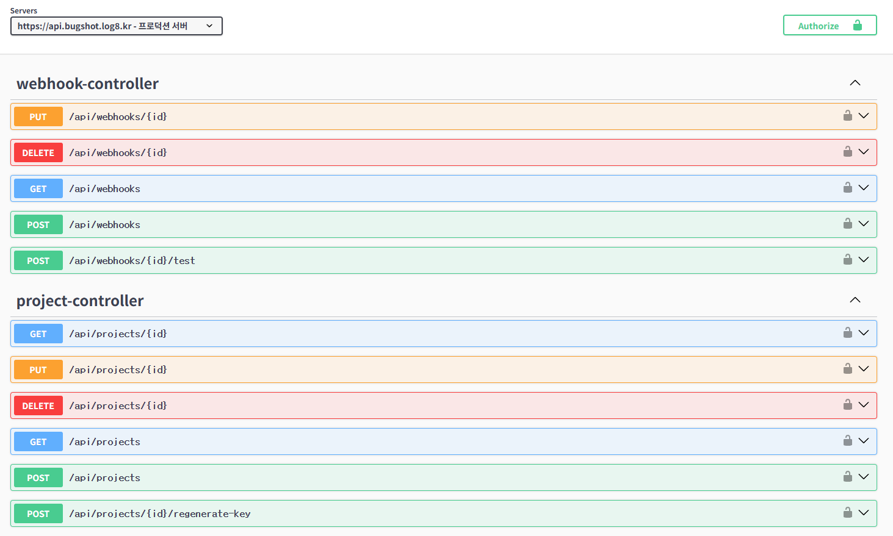
_Figure 1: Webhook and Project API endpoints in Swagger UI_

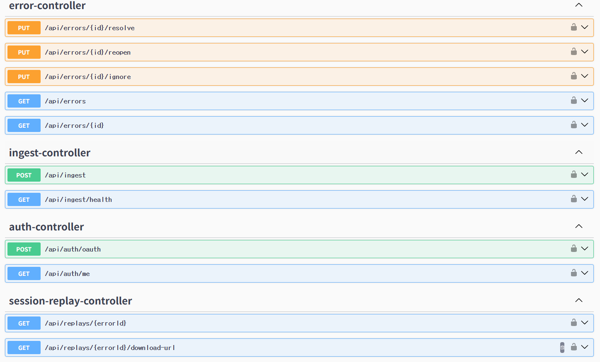
_Figure 2: Error, Ingest, Auth, and Session Replay API endpoints_

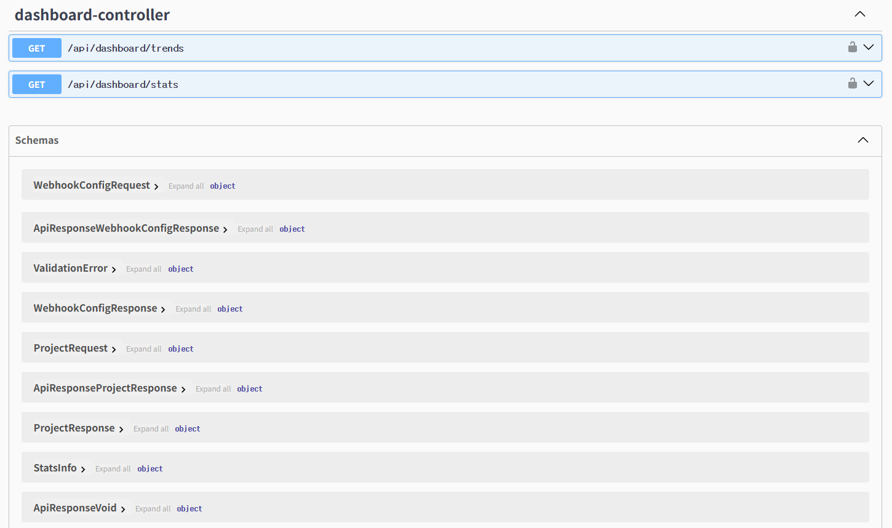
_Figure 3: Dashboard API and data schemas_

### 2. Error Ingest API (Core Feature)

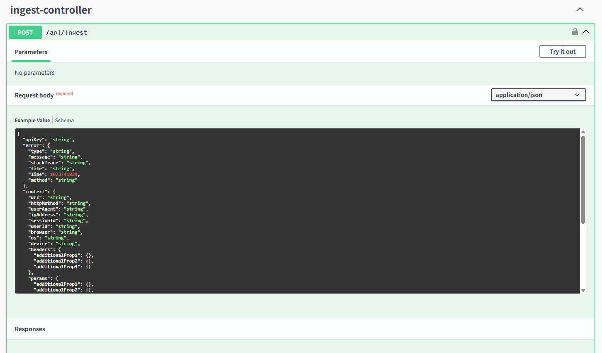
_Figure 4: POST /api/ingest - SDK sends error data with this endpoint_

### 3. Dashboard

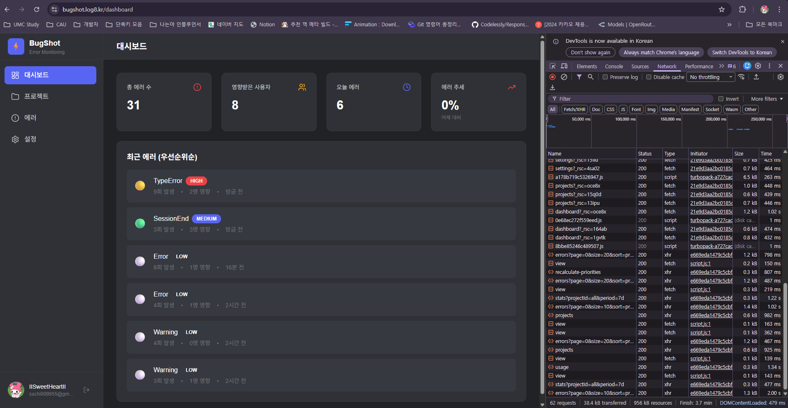
_Figure 5: Dashboard showing error statistics and priority-sorted errors_

### 4. Project Management

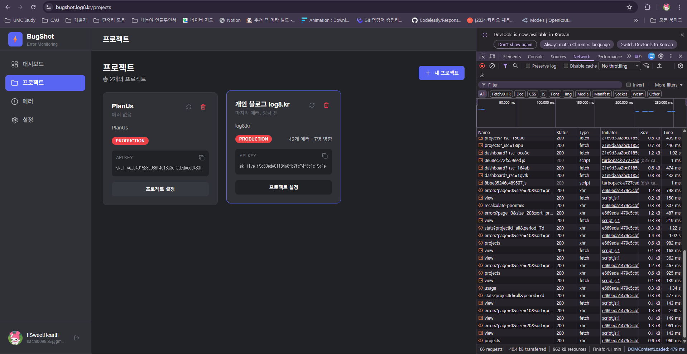
_Figure 6: Project list with API keys for SDK integration_

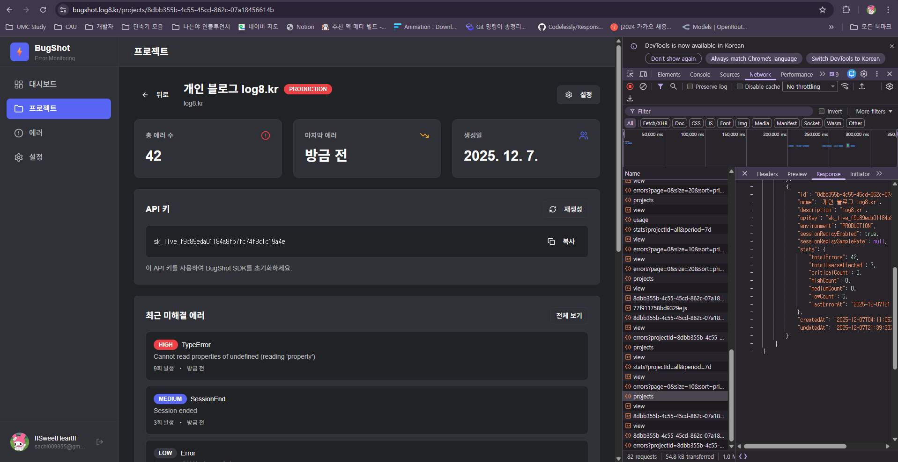
_Figure 7: Project detail showing errors, API key, recent unresolved errors_

### 5. Error Detail

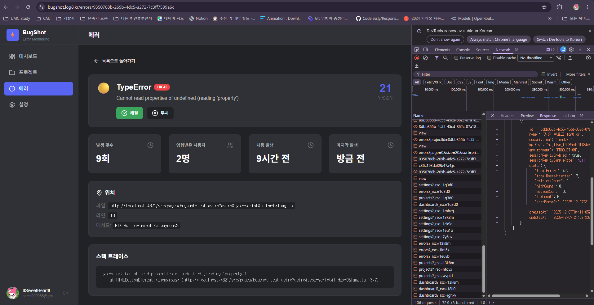
_Figure 8: Error detail - TypeError with HIGH priority, occurrences, affected users, stack trace_

### 6. Webhook Configuration

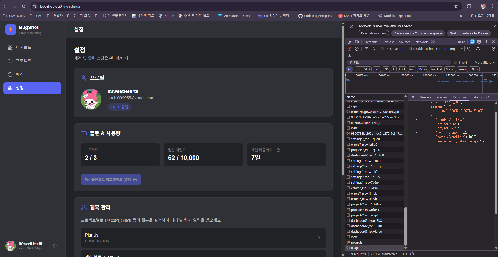
_Figure 9: User settings - plan, usage statistics, webhook management_

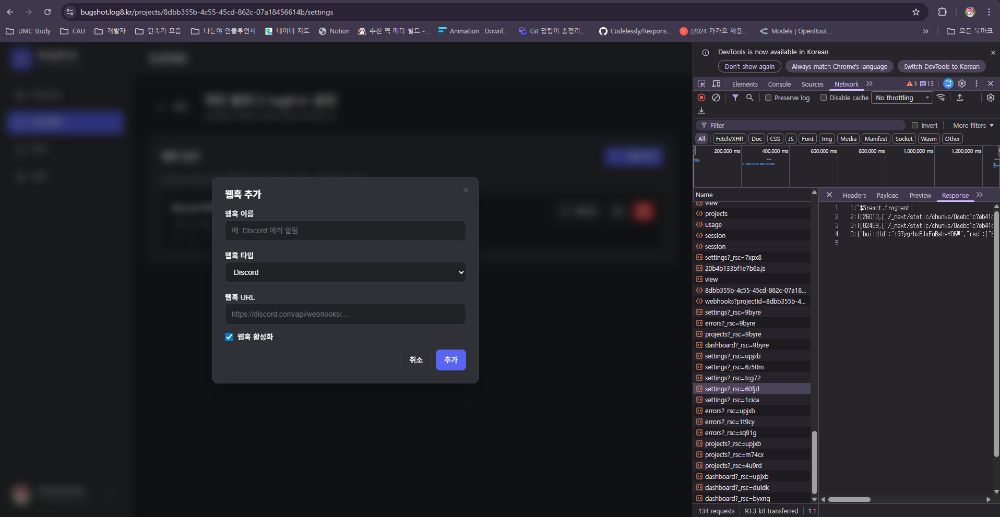
_Figure 10: Adding Discord webhook_

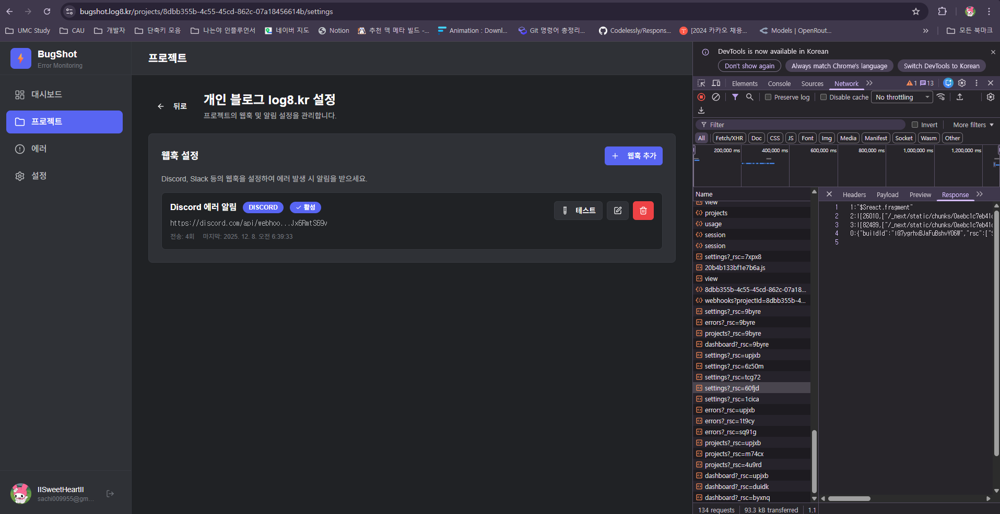
_Figure 11: Configured Discord webhook with test button_

### 7. Notification Result

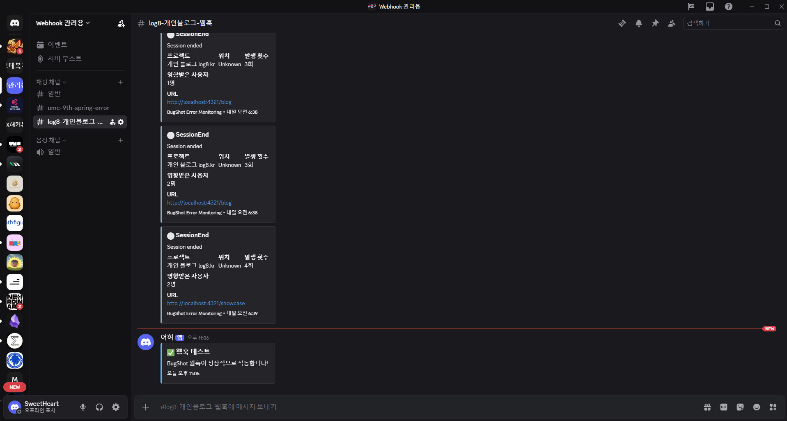
_Figure 12: Discord receiving error notifications from Bugshot_

### 8. SDK Test Page

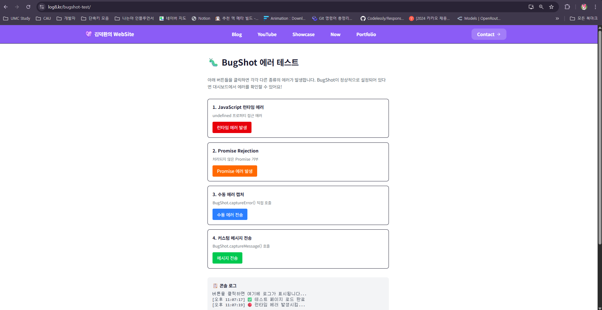
_Figure 13: SDK test page with buttons to trigger different error types_

---

## (g) Object-Oriented Concepts Applied

### 1. Inheritance

**BaseEntity** provides common audit fields to all entities:

    @MappedSuperclass
    public abstract class BaseEntity {
        @CreatedDate private LocalDateTime createdAt;
        @LastModifiedDate private LocalDateTime updatedAt;
    }

    // All entities inherit from BaseEntity
    @Entity public class User extends BaseEntity { ... }
    @Entity public class Project extends BaseEntity { ... }
    @Entity public class Error extends BaseEntity { ... }

**Inheritance Hierarchy:**
BaseEntity (abstract)
├── User
├── Project
├── Error
├── ErrorOccurrence
├── NotificationChannel
├── SessionReplay
└── WebhookConfig

### 2. Polymorphism

**NotificationStrategy** interface with 6 implementations:

    // Interface
    public interface NotificationStrategy {
        ChannelType getChannelType();
        void send(NotificationChannel channel, Project project, Error error, ErrorOccurrence occurrence);
    }

    // Implementations
    @Component public class DiscordNotificationStrategy implements NotificationStrategy { ... }
    @Component public class SlackNotificationStrategy implements NotificationStrategy { ... }
    @Component public class EmailNotificationStrategy implements NotificationStrategy { ... }

    // Polymorphic call - Runtime dispatch
    NotificationStrategy strategy = registry.getStrategy(channel.getChannelType());
    strategy.send(channel, project, error, occurrence);

### 3. Encapsulation

Entity classes expose behavior through methods, not direct field access:

    @Entity
    @Getter  // Only getter, no setter
    public class Error extends BaseEntity {
        private Integer occurrenceCount = 1;
        private ErrorStatus status = ErrorStatus.UNRESOLVED;

        // Business logic encapsulated in methods
        public void incrementOccurrence() {
            this.occurrenceCount++;
            this.lastSeenAt = LocalDateTime.now();
        }

        public void resolve(String userId) {
            this.status = ErrorStatus.RESOLVED;
            this.resolvedAt = LocalDateTime.now();
        }

        // Complex logic in private methods
        private double determinePageWeight(String url) { ... }
    }

### 4. Abstraction

Complex logic abstracted behind simple interfaces:

    // Simple public interface
    public void notifyError(Project project, Error error, ErrorOccurrence occurrence) {
        List<NotificationChannel> channels = channelRepository.findByProjectIdAndEnabledTrue(project.getId());
        for (NotificationChannel channel : channels) {
            if (channel.shouldNotify(error.getSeverity())) {
                sendNotification(channel, project, error, occurrence);
            }
        }
    }

    // Internal complexity hidden in private methods

### 5. Design Patterns Applied

| Pattern         | Location                   | Purpose                         |
| --------------- | -------------------------- | ------------------------------- |
| Strategy        | notification/strategy/\*   | Different notification channels |
| Observer        | error/event/listener/\*    | Async event processing          |
| Template Method | BaseEntity                 | Entity lifecycle management     |
| Factory         | Error.calculateErrorHash() | Error hash generation           |
| Repository      | \*Repository interfaces    | Data access abstraction         |
| Builder         | Lombok @Builder            | Complex object construction     |

---

## (h) Conclusion

### Project Summary

Bugshot successfully demonstrates the application of Object-Oriented Programming concepts in building a real-world error monitoring system:

1. **Practical OOP Application**: Inheritance (BaseEntity), Polymorphism (NotificationStrategy), Encapsulation (Entity methods), and Abstraction (Service layer)

2. **Design Pattern Usage**: Strategy Pattern for notifications, Observer Pattern for event-driven architecture, Template Method for entity lifecycle

3. **Real-world Deployment**: The system is deployed at https://bugshot-api.log8.kr

### Technical Achievements

- SHA-256 based error deduplication algorithm
- Multi-factor priority scoring system
- Event-driven architecture with Spring @Async
- Strategy pattern supporting 6 notification channels
- Rate limiting (API key + IP based)
- RESTful API with Swagger documentation

### Lessons Learned

- Importance of proper abstraction for maintainability
- Value of design patterns in solving common problems
- Benefits of event-driven architecture for scalability

---

## Appendix

### Technology Stack

| Category  | Technology                    |
| --------- | ----------------------------- |
| Language  | Java 21                       |
| Framework | Spring Boot 3.5               |
| Database  | MySQL 8.0, Redis 6.0          |
| ORM       | Spring Data JPA               |
| Build     | Gradle 8.x                    |
| API Docs  | SpringDoc OpenAPI (Swagger)   |
| Async     | Spring @Async, @EventListener |
| Storage   | Cloudflare R2                 |

### Links

- Service Link: https://bugshot.log8.kr
- Swagger UI: https://bugshot-api.log8.kr/swagger-ui/index.html
- GitHub: https://github.com/IISweetHeartII/bugshot

---

**End of Report**
