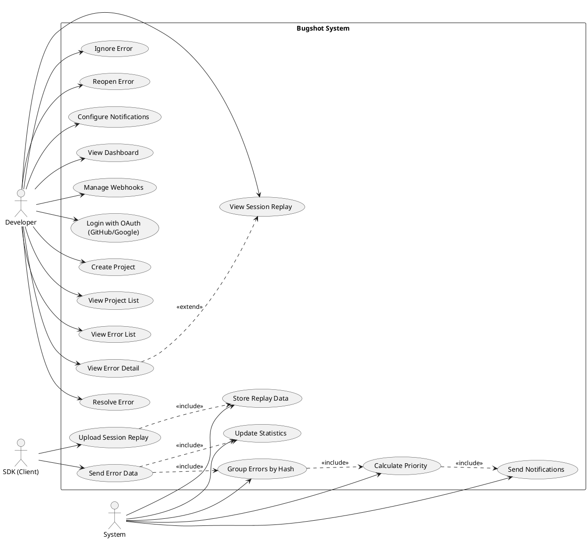
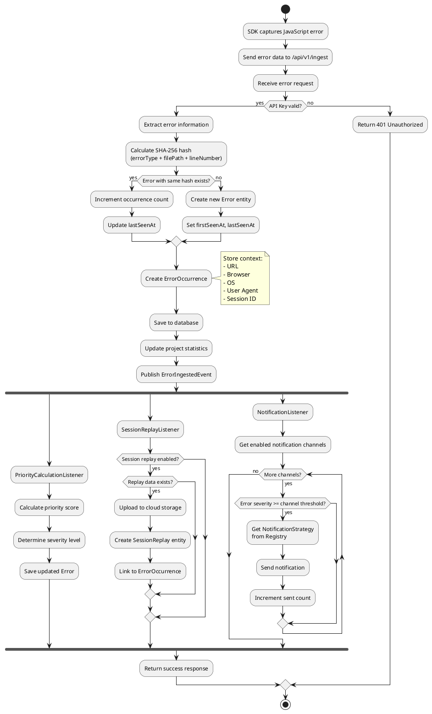
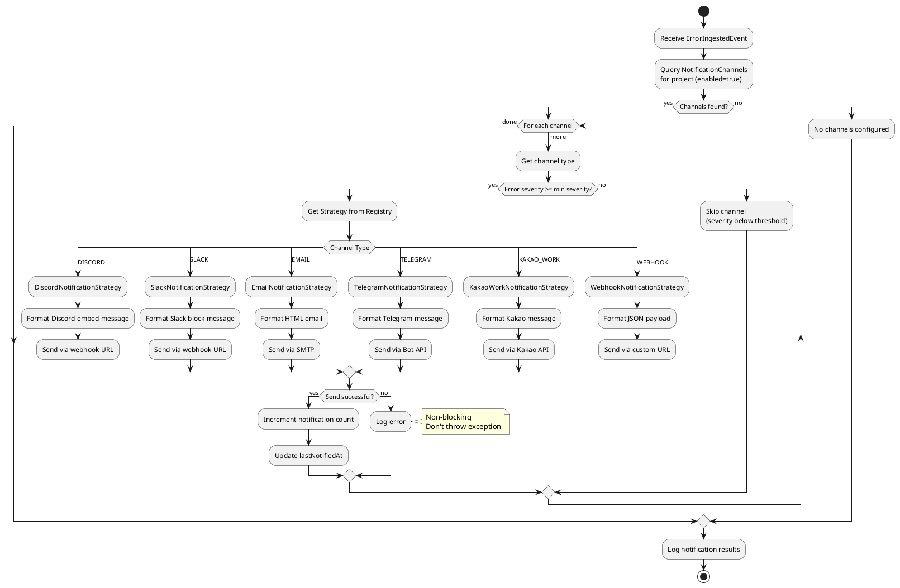

# Bugshot UML Diagrams

이 문서는 UML 다이어그램을 그리기 위한 상세 내용을 포함합니다.
아래 PlantUML 코드를 사용하거나, 내용을 참고하여 draw.io, StarUML 등으로 그릴 수 있습니다.

---

## 1. Class Diagram (클래스 다이어그램)

### PlantUML Code

```plantuml
@startuml Bugshot_Class_Diagram

' ===== STYLE =====
skinparam classAttributeIconSize 0
skinparam class {
    BackgroundColor White
    BorderColor Black
}

' ===== ABSTRACT CLASS =====
abstract class BaseEntity {
    - createdAt: LocalDateTime
    - updatedAt: LocalDateTime
    # onCreate(): void
    # onUpdate(): void
}

' ===== ENTITIES =====
class User {
    - id: String
    - email: String
    - name: String
    - avatarUrl: String
    - githubId: String
    - googleId: String
    - planType: PlanType
    - projects: List<Project>
    + canCreateProject(): boolean
    + upgradePlan(newPlan: PlanType): void
}

class Project {
    - id: String
    - user: User
    - name: String
    - description: String
    - apiKey: String
    - environment: Environment
    - sessionReplayEnabled: Boolean
    - sessionReplaySampleRate: BigDecimal
    - totalErrors: Integer
    - totalUsersAffected: Integer
    - lastErrorAt: LocalDateTime
    - errors: List<Error>
    + incrementErrorCount(): void
    + regenerateApiKey(): String
    + updateSettings(...): void
}

class Error {
    - id: String
    - project: Project
    - errorHash: String
    - errorType: String
    - errorMessage: String
    - filePath: String
    - lineNumber: Integer
    - methodName: String
    - stackTrace: String
    - priorityScore: BigDecimal
    - severity: Severity
    - occurrenceCount: Integer
    - affectedUsersCount: Integer
    - status: ErrorStatus
    - resolvedAt: LocalDateTime
    - resolvedBy: String
    - firstSeenAt: LocalDateTime
    - lastSeenAt: LocalDateTime
    - occurrences: List<ErrorOccurrence>
    + incrementOccurrence(): void
    + calculatePriority(url: String): void
    + resolve(userId: String): void
    + ignore(): void
    + reopen(): void
    {static} + calculateErrorHash(...): String
}

class ErrorOccurrence {
    - id: String
    - error: Error
    - url: String
    - httpMethod: String
    - userAgent: String
    - ipAddress: String
    - userIdentifier: String
    - sessionId: String
    - browser: String
    - os: String
    - device: String
    - requestHeaders: Map
    - requestParams: Map
    - customData: Map
    - sessionReplayId: String
    - occurredAt: LocalDateTime
    + attachSessionReplay(replayId: String): void
}

class SessionReplay {
    - id: String
    - project: Project
    - errorOccurrence: ErrorOccurrence
    - sessionId: String
    - replayDataUrl: String
    - durationMs: Integer
    - eventsCount: Integer
    - fileSizeBytes: Integer
    - isCompressed: Boolean
    - compressionType: String
    - recordedAt: LocalDateTime
    - expiresAt: LocalDateTime
    + isExpired(): boolean
    + extendExpiration(days: int): void
}

class NotificationChannel {
    - id: String
    - project: Project
    - channelType: ChannelType
    - config: Map<String, Object>
    - minSeverity: Severity
    - enabled: Boolean
    - totalNotificationsSent: Integer
    - lastNotifiedAt: LocalDateTime
    + shouldNotify(severity: Severity): boolean
    + incrementNotificationCount(): void
    + enable(): void
    + disable(): void
    + updateConfig(config: Map): void
}

class WebhookConfig {
    - id: String
    - project: Project
    - type: WebhookType
    - name: String
    - webhookUrl: String
    - enabled: boolean
    - severityFilters: List<String>
    - environmentFilters: List<String>
    - totalSent: long
    - failureCount: long
    - lastTriggeredAt: LocalDateTime
    + updateConfig(...): void
    + recordSuccess(): void
    + recordFailure(): void
}

' ===== ENUMS =====
enum PlanType {
    FREE
    PRO
    TEAM
}

enum Environment {
    DEVELOPMENT
    STAGING
    PRODUCTION
}

enum Severity {
    CRITICAL
    HIGH
    MEDIUM
    LOW
}

enum ErrorStatus {
    UNRESOLVED
    RESOLVED
    IGNORED
}

enum ChannelType {
    DISCORD
    SLACK
    TELEGRAM
    EMAIL
    WEBHOOK
    KAKAO_WORK
}

enum WebhookType {
    DISCORD
    SLACK
    TELEGRAM
    CUSTOM
}

' ===== STRATEGY PATTERN =====
interface NotificationStrategy {
    + getChannelType(): ChannelType
    + send(channel, project, error, occurrence): void
    + sendTest(channel): void
}

class DiscordNotificationStrategy implements NotificationStrategy {
    + getChannelType(): ChannelType
    + send(...): void
    + sendTest(channel): void
}

class SlackNotificationStrategy implements NotificationStrategy {
    + getChannelType(): ChannelType
    + send(...): void
}

class EmailNotificationStrategy implements NotificationStrategy {
    + getChannelType(): ChannelType
    + send(...): void
}

class KakaoWorkNotificationStrategy implements NotificationStrategy {
    + getChannelType(): ChannelType
    + send(...): void
}

class TelegramNotificationStrategy implements NotificationStrategy {
    + getChannelType(): ChannelType
    + send(...): void
}

class WebhookNotificationStrategy implements NotificationStrategy {
    + getChannelType(): ChannelType
    + send(...): void
}

class NotificationStrategyRegistry {
    - strategies: Map<ChannelType, NotificationStrategy>
    + getStrategy(type: ChannelType): Optional<NotificationStrategy>
    + getStrategyOrThrow(type: ChannelType): NotificationStrategy
}

' ===== SERVICES =====
class ErrorService {
    - errorRepository: ErrorRepository
    - occurrenceRepository: ErrorOccurrenceRepository
    - projectRepository: ProjectRepository
    - eventPublisher: ApplicationEventPublisher
    + ingestError(request: IngestRequest): IngestResponse
    + getError(errorId: String): Error
    + resolveError(errorId: String, userId: String): void
    + ignoreError(errorId: String): void
    + reopenError(errorId: String): void
}

class NotificationService {
    - channelRepository: NotificationChannelRepository
    - strategyRegistry: NotificationStrategyRegistry
    + notifyError(project, error, occurrence): void
    + sendTestNotification(channel): void
}

' ===== EVENT (Observer Pattern) =====
class ErrorIngestedEvent {
    - project: Project
    - error: Error
    - occurrence: ErrorOccurrence
    - url: String
    - sessionReplayData: String
    - sessionReplayEnabled: Boolean
}

class NotificationListener {
    - notificationService: NotificationService
    + handleErrorIngested(event: ErrorIngestedEvent): void
}

class PriorityCalculationListener {
    + handleErrorIngested(event: ErrorIngestedEvent): void
}

class SessionReplayListener {
    - sessionReplayService: SessionReplayService
    + handleErrorIngested(event: ErrorIngestedEvent): void
}

' ===== RELATIONSHIPS =====
BaseEntity <|-- User
BaseEntity <|-- Project
BaseEntity <|-- Error
BaseEntity <|-- NotificationChannel

User "1" *-- "0..*" Project : owns
Project "1" *-- "0..*" Error : contains
Project "1" *-- "0..*" NotificationChannel : has
Project "1" *-- "0..*" SessionReplay : stores
Project "1" *-- "0..*" WebhookConfig : configures

Error "1" *-- "0..*" ErrorOccurrence : has
ErrorOccurrence "1" -- "0..1" SessionReplay : linked

User ..> PlanType : uses
Project ..> Environment : uses
Error ..> Severity : uses
Error ..> ErrorStatus : uses
NotificationChannel ..> ChannelType : uses
WebhookConfig ..> WebhookType : uses

NotificationService --> NotificationStrategyRegistry : uses
NotificationStrategyRegistry --> NotificationStrategy : manages
NotificationListener --> NotificationService : calls

ErrorService ..> ErrorIngestedEvent : publishes
NotificationListener ..> ErrorIngestedEvent : listens
PriorityCalculationListener ..> ErrorIngestedEvent : listens
SessionReplayListener ..> ErrorIngestedEvent : listens

@enduml
```

### 클래스 설명

| 클래스 | 설명 | 주요 메서드 |
|--------|------|-------------|
| **BaseEntity** | 모든 엔티티의 부모 클래스 | createdAt, updatedAt 자동 관리 |
| **User** | 사용자 정보 (OAuth 지원) | canCreateProject(), upgradePlan() |
| **Project** | 프로젝트 (API 키 관리) | regenerateApiKey(), incrementErrorCount() |
| **Error** | 에러 그룹 (해시 기반 중복 제거) | calculatePriority(), resolve(), ignore() |
| **ErrorOccurrence** | 에러 발생 인스턴스 | attachSessionReplay() |
| **SessionReplay** | 세션 리플레이 데이터 | isExpired(), extendExpiration() |
| **NotificationChannel** | 알림 채널 설정 | shouldNotify(), incrementNotificationCount() |
| **NotificationStrategy** | 알림 전략 인터페이스 | send(), sendTest() |

---

## 2. Use-Case Diagram (유스케이스 다이어그램)

### PlantUML Code

### Use Case 설명

#### Actors (액터)

| 액터 | 설명 |
|------|------|
| **Developer** | 웹 애플리케이션 개발자. Bugshot 대시보드를 통해 에러를 관리함 |
| **SDK (Client)** | 개발자의 웹 애플리케이션에 설치된 JavaScript SDK |
| **System** | 자동화된 백엔드 프로세스 |

#### Use Cases

| ID | Use Case | Actor | 설명 |
|----|----------|-------|------|
| UC1 | Login with OAuth | Developer | GitHub/Google로 로그인 |
| UC2 | Create Project | Developer | 새 프로젝트 생성 및 API 키 발급 |
| UC3 | View Project List | Developer | 프로젝트 목록 조회 |
| UC4 | View Error List | Developer | 프로젝트의 에러 목록 조회 |
| UC5 | View Error Detail | Developer | 에러 상세 정보 확인 |
| UC6 | Resolve Error | Developer | 에러를 해결됨으로 표시 |
| UC7 | Ignore Error | Developer | 에러를 무시함으로 표시 |
| UC8 | Reopen Error | Developer | 해결된 에러를 다시 열기 |
| UC9 | Configure Notifications | Developer | 알림 채널 설정 (Discord, Slack 등) |
| UC10 | View Session Replay | Developer | 에러 발생 시점의 세션 리플레이 확인 |
| UC11 | View Dashboard | Developer | 에러 통계 및 트렌드 확인 |
| UC12 | Manage Webhooks | Developer | 커스텀 웹훅 설정 |
| UC13 | Send Error Data | SDK | 에러 발생 시 서버로 데이터 전송 |
| UC14 | Upload Session Replay | SDK | 세션 리플레이 데이터 업로드 |
| UC15 | Group Errors by Hash | System | SHA-256 해시로 에러 그룹화 |
| UC16 | Calculate Priority | System | 에러 우선순위 자동 계산 |
| UC17 | Send Notifications | System | 설정된 채널로 알림 전송 |
| UC18 | Store Replay Data | System | 리플레이 데이터 클라우드 저장 |
| UC19 | Update Statistics | System | 프로젝트/대시보드 통계 업데이트 |

---

## 3. Activity Diagram (활동 다이어그램)

### PlantUML Code - Error Ingest Process

### PlantUML Code - Notification Flow

### 활동 흐름 설명

#### Error Ingest Process (에러 수집 프로세스)

1. **SDK 에러 캡처**: 브라우저에서 JavaScript 에러 발생 감지
2. **API 요청**: POST /api/v1/ingest로 에러 데이터 전송
3. **API 키 검증**: 요청의 API 키가 유효한지 확인
4. **해시 계산**: SHA-256으로 에러 식별자 생성
5. **중복 확인**: 같은 해시의 에러가 있으면 카운트 증가, 없으면 새로 생성
6. **Occurrence 생성**: 에러 발생 컨텍스트 저장
7. **이벤트 발행**: ErrorIngestedEvent로 후속 작업 트리거
8. **병렬 처리**:
   - 우선순위 계산
   - 세션 리플레이 저장
   - 알림 전송

#### Notification Flow (알림 전송 흐름)

1. **채널 조회**: 프로젝트의 활성화된 알림 채널 조회
2. **심각도 필터링**: 에러 심각도가 채널 임계값 이상인지 확인
3. **전략 선택**: ChannelType에 맞는 Strategy 선택
4. **메시지 전송**: 채널별 포맷으로 메시지 전송
5. **결과 기록**: 전송 성공/실패 기록

---

## 다이어그램 그리기 도구

### 온라인 도구
1. **PlantUML Online**: https://www.plantuml.com/plantuml/
2. **draw.io**: https://app.diagrams.net/
3. **Lucidchart**: https://www.lucidchart.com/

### 데스크톱 도구
1. **StarUML**: https://staruml.io/
2. **Visual Paradigm**: https://www.visual-paradigm.com/

### VS Code 확장
1. **PlantUML** extension - 코드로 다이어그램 생성

---

## 사용 방법

1. PlantUML 코드를 복사
2. https://www.plantuml.com/plantuml/ 접속
3. 코드 붙여넣기
4. PNG/SVG로 다운로드
5. 보고서에 삽입

또는

1. draw.io 접속
2. 위의 클래스/관계 정보를 참고하여 수동으로 그리기
3. PNG로 내보내기
